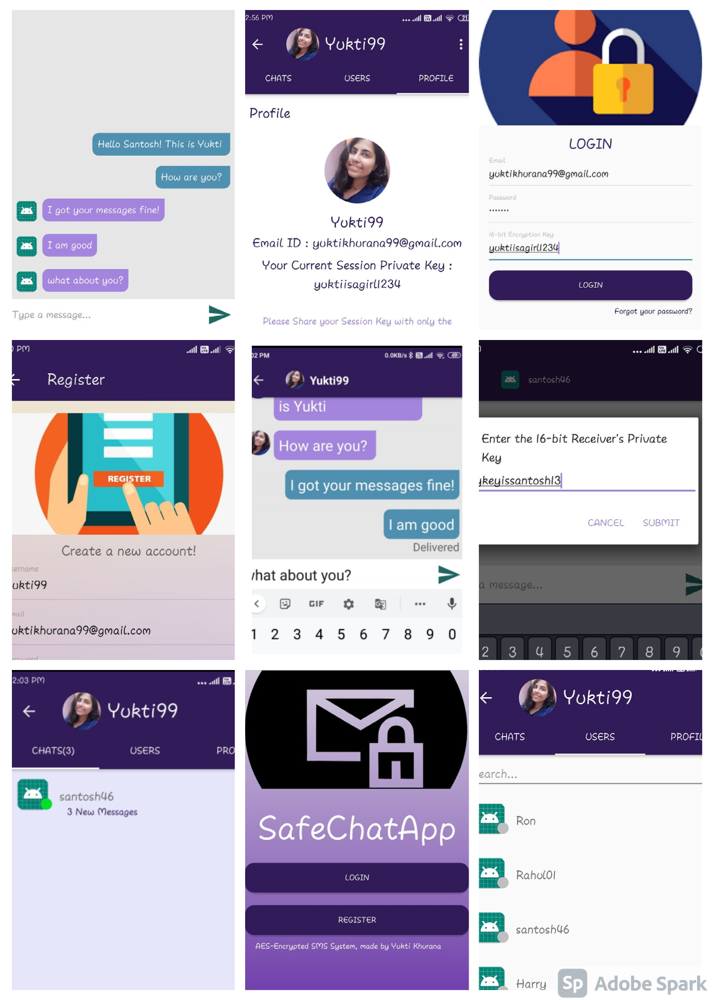

# Encrypted-Messaging-App
A chatting application with end-to-end AES encryption wherein users can use a distinct 16-character encryption key for each login/messaging session. It provides security and integrity to prevent message snooping by malicious entities.

